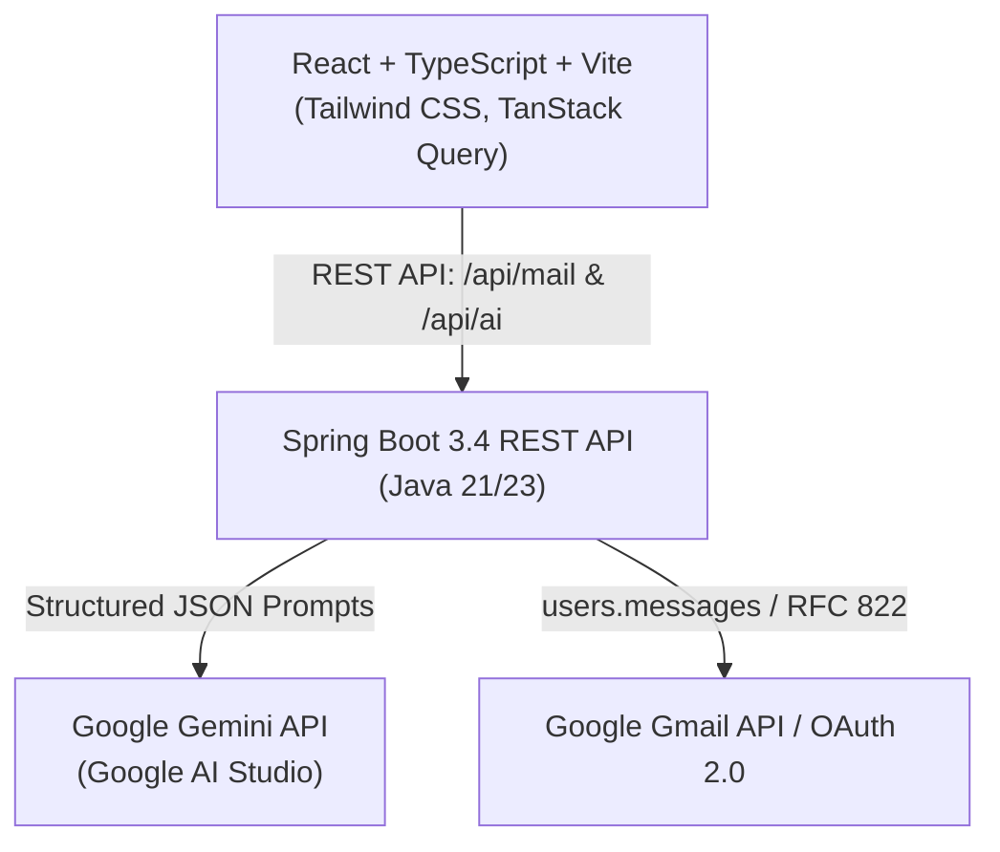

# AI Mail Manager

**AI Mail Manager** is an enterprise-ready, full-stack email productivity system powered by **Google Gemini** and the **Gmail API**. It analyzes, prioritizes, and classifies incoming emails, generates context-aware reply drafts across multiple tones, and enforces strict **human-in-the-loop review** before sending any outbound communication.

---

## 🌟 Key Features

* **AI Email Analysis & Classification**: Uses Google Gemini to detect category (`JOB`, `WORK`, `PERSONAL`, `FINANCE`, `NEWSLETTER`, `SUPPORT`), priority level (`URGENT`, `HIGH`, `MEDIUM`, `LOW`), sentiment, key takeaways, and action items.
* **Smart AI Reply Assistant**: Synthesizes draft replies adapted to the original language with customizable tones (*Professional*, *Friendly*, *Concise*, *Formal*, *Direct*) and custom user prompt guidance.
* **Human-in-the-Loop Architecture**: AI **never** automatically sends emails. Every generated draft is fully editable in an interactive editor and requires explicit user review and confirmation before dispatching via the Gmail API.
* **Zero Database / Zero Storage**: No email bodies, attachments, or OAuth tokens are persistently stored in a database. Gmail remains the single source of truth.
* **Provider Abstraction**: Extensible mail provider layer (`MailProvider` interface) supporting the official Google Gmail API, with immediate fallback to a realistic simulated seed provider (`MockMailProvider`) for instant local development without credentials.
* **OpenAPI & Swagger UI**: Full interactive API documentation available out of the box.

---

## 🏗️ Architecture



### Backend Package Organization (`com.mailmanager`)
```text
com.mailmanager
├── MailManagerApplication.java
├── config/                  # Security, CORS, OpenAPI, Gemini & Mail Properties
├── common/
│   ├── dto/                 # ApiResponse, ErrorResponse
│   └── exception/           # GlobalExceptionHandler & Domain Exceptions
├── mail/
│   ├── controller/          # MailController (REST API)
│   ├── service/             # MailService (Provider delegation & filtering)
│   ├── model/               # Email, EmailMessage, EmailRecipient, Attachment
│   └── provider/            # MailProvider interface, GmailProvider, MockMailProvider
├── ai/
│   ├── controller/          # AiController (REST API)
│   ├── service/             # AiService interface, GeminiAiService
│   └── model/               # EmailAnalysis, EmailCategory, ReplySuggestionRequest, ReplyTone
└── health/
    └── controller/          # HealthController (System Diagnostics)
```

---

## 🛠️ Technology Stack

### Backend
* **Java 21 / 23 LTS**
* **Spring Boot 3.4.x** (Spring Web, Spring Security)
* **Google Gemini API** (via Google AI Studio with structured JSON schema inference)
* **Official Google Gmail API** (`google-api-services-gmail`)
* **SpringDoc OpenAPI / Swagger UI 3.0**
* **Jakarta Validation & Jackson**
* **JUnit 5 & Mockito**

### Frontend
* **React 19 & TypeScript**
* **Vite 6**
* **Tailwind CSS v4**
* **TanStack Query (React Query v5)**
* **React Router DOM v7**
* **Lucide React Icons**
* **Vitest & React Testing Library**

---

## 📋 Prerequisites

* **Java JDK 21** or later (e.g. OpenJDK 21/23)
* **Apache Maven 3.9+**
* **Node.js 20+** and **npm**

---

## ⚙️ Configuration & Environment Variables

Copy the template environment file:

```bash
cp .env.example .env
```

| Variable | Description | Default |
| :--- | :--- | :--- |
| `SERVER_PORT` | Backend server port | `8080` |
| `GEMINI_API_KEY` | Google AI Studio API key | *(Optional in dev mode)* |
| `GEMINI_MODEL` | Gemini Model identifier | `gemini-2.5-flash` |
| `MAIL_PROVIDER_TYPE` | Active mail provider (`MOCK` or `GMAIL`) | `MOCK` |
| `GOOGLE_CLIENT_ID` | Google Cloud OAuth Client ID | *(Optional in dev mode)* |
| `GOOGLE_CLIENT_SECRET` | Google Cloud OAuth Client Secret | *(Optional in dev mode)* |

> [!TIP]
> **Zero-Setup Quickstart**: If `GEMINI_API_KEY` or `GOOGLE_CLIENT_ID` are omitted, the application seamlessly operates in **Demo/Mock mode** with 6 realistic simulated email threads and local deterministic AI heuristic fallback.

---

## 🔑 How to Configure Credentials

### 1. Google Gemini API Key
1. Go to [Google AI Studio](https://aistudio.google.com/).
2. Create a free API Key.
3. Set `GEMINI_API_KEY=your_actual_key` in your environment or `.env`.

### 2. Google Cloud OAuth & Gmail API
1. Navigate to the [Google Cloud Console](https://console.cloud.google.com/).
2. Create a new project and enable the **Gmail API**.
3. Configure the **OAuth Consent Screen** and add the scope: `https://www.googleapis.com/auth/gmail.modify`.
4. Create **OAuth 2.0 Client Credentials** (Web Application) with redirect URI: `http://localhost:8080/api/auth/oauth2/callback/google`.
5. Set `GOOGLE_CLIENT_ID` and `GOOGLE_CLIENT_SECRET` in `.env`.
6. Set `MAIL_PROVIDER_TYPE=GMAIL`.

---

## 🚀 Running the Project

### 1. Start the Backend

```bash
cd backend
mvn spring-boot:run
```
* Backend starts at `http://localhost:8080`
* Swagger UI documentation: `http://localhost:8080/swagger-ui.html`
* Health check: `http://localhost:8080/api/health`

### 2. Start the Frontend

```bash
cd frontend
npm install
npm run dev
```
* Frontend starts at `http://localhost:5173`

---

## 📡 REST API Endpoints

### Mail Endpoints
* `GET /api/mail` - List emails (supports `?q=search_term` and `?limit=50`)
* `GET /api/mail/{id}` - Fetch single email details
* `POST /api/mail/{id}/read` - Mark email as read
* `POST /api/mail/{id}/unread` - Mark email as unread
* `POST /api/mail/{id}/archive` - Archive email
* `POST /api/mail/send` - Send an outbound email message
* `GET /api/mail/provider` - Get active provider information

### AI Endpoints
* `POST /api/ai/analyze/{emailId}` - Run Gemini analysis on an email
* `POST /api/ai/reply/{emailId}` - Generate contextual AI reply draft with tone controls
* `GET /api/ai/status` - Check Gemini configuration status and model name

### System Health
* `GET /api/health` - Diagnostic status of mail provider and AI connection

---

## 🧪 Running Tests

### Backend Tests (JUnit 5 & Mockito)
```bash
cd backend
mvn clean test
```

### Frontend Tests (Vitest & React Testing Library)
```bash
cd frontend
npm test
```

---

## 🔒 Security & Privacy Guarantees

1. **No Data Storage**: The application operates statelessly. No emails, user messages, or tokens are written to disk or database.
2. **Key Isolation**: `GEMINI_API_KEY` and Google Cloud OAuth secrets are strictly held on the Spring Boot backend and are never sent to or exposed in the browser.
3. **No Unsupervised Actions**: The system is architected around human supervision. AI generates suggestions; only explicit user clicks trigger sending emails.
